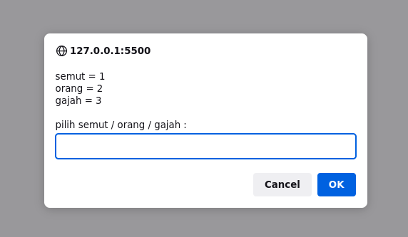
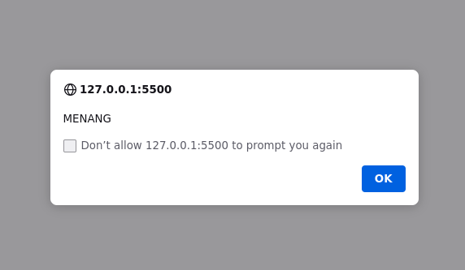
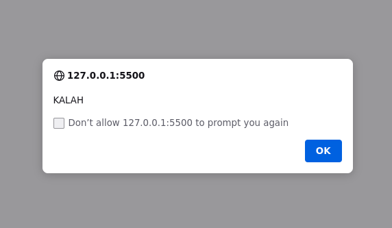
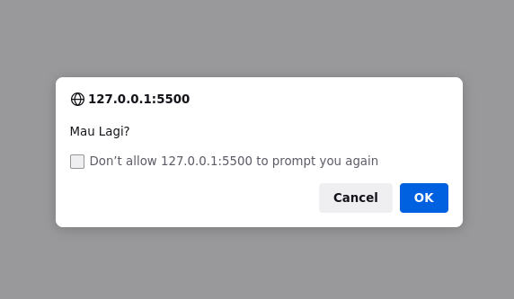

# Suite Jawa

#### INTRODUCTION

## 1. What is Javanese Suite

Javanese suit is a small children's game played by two children. It's like a game of suits: scissors, paper, rock. In this game, the elephant wins against the person, the person wins against the ant, and the ant wins against the elephant. Usually, kids do this suit if they want to determine who will do what

---

### How to Create Javanese Suite

## 1. Creat HTML

- First, go to your code editor.
- creat an html file named "index.html".
- fill index.html like as below:

```<!DOCTYPE html>
<html lang="en">
  <head>
    <meta charset="UTF-8" />
    <meta http-equiv="X-UA-Compatible" content="IE=edge" />
    <meta name="viewport" content="width=device-width, initial-scale=1.0" />
    <title>Suite Jawa v1.0</title>
  </head>
  <body>
    <script src="script.js"></script>
  </body>
</html>
```

## 2. Create Javascript

- create javascript file name "script.js"

## 3. Define Computer Choice

- open script.js then
- fill 'script.js' as below

```
// define computer choice
// mendefinisikan pilihan komputer
repeat = true;
while (repeat) {
  var comp = Math.random(),
    suitecomp = "";

  if (comp < 0.34) {
    var suitecomp = "semut";
  } else if (comp > 0.34 && comp < 0.67) {
    var suitecomp = "orang";
  } else {
    var suitecomp = "gajah";
  }
```

## 3. Define Computer Choice

```
// define user choice
// mendefinisikan pilihan user
  var user = prompt(
    "semut = 1\norang = 2\ngajah = 3\n\npilih semut / orang / gajah : "
  );

  if (user == 1) {
    var user = "semut";
  } else if (user == 2) {
    var user = "orang";
  } else if (user == 3) {
    var user = "gajah";
  } else {
    alert("tolong plih salah satu diantara semut / orang / gajah");
  }

```

## 4. Define Result

```
// define result
// mendefinisikan hasil
  var hasil = "";
  if (suitecomp == user) {
    var hasil = "SERI";
  } else if (user == "semut") {
    var hasil = suitecomp == "gajah" ? "MENANG" : "KALAH";
  } else if (user == "orang") {
    var hasil = suitecomp == "semut" ? "MENANG" : "KALAH";
  } else if (user == "gajah") {
    var hasil = suitecomp == "orang" ? "MENANG" : "KALAH";
  }
  alert(hasil);
  repeat = confirm("Mau Lagi?");
}

```

## 5. Run the Program

- open index.html then
- open in your browser

### user input choice



### if user win



#### if user lose



### if result is appeared then appear confirmation alert



## Author

- [Wijaya](https://www.instagram.com/wijaya5521_)

## Version History

- 1.0
  - Initial Release

## Have feedback/requests/issues?

Please [create a new issue](https://github.com/wijaya5521/suite-jawa). PRs are definitely welcome, but please run your ideas by me before putting in a lot of work. Thanks!

## License

This project is licensed under the GNU Public License v3.0 - see the LICENSE.md file for details

## Acknowledgments

thank you very much to those below who inspired me to make this

- [Web Programing Unpas](https://www.youtube.com/c/WebProgrammingUNPAS)
